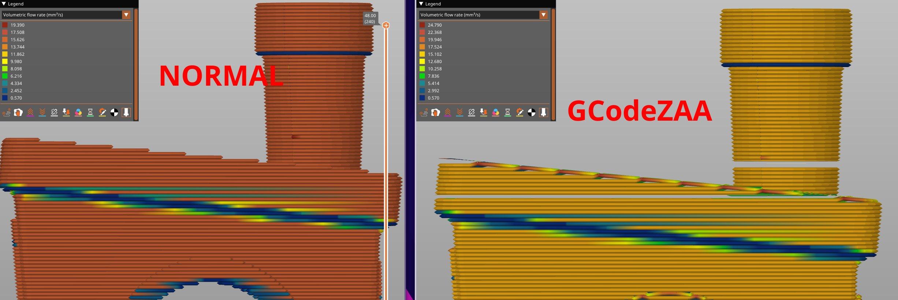
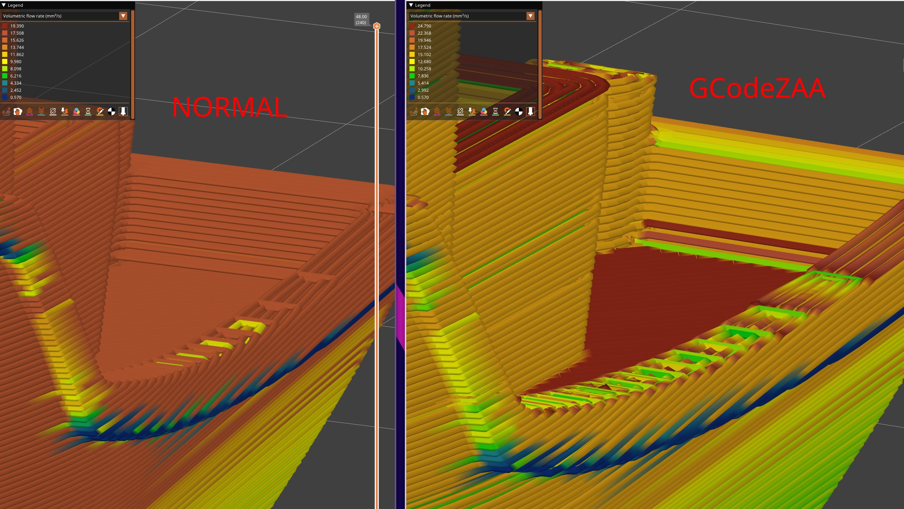

# GCodeZAA

This is a post-processing script to enable smooth(-ish) non-planar top surfaces through
a process I've come to call "Z Anti-Aliasing", to differentiate it from true non-planar
top surfaces. Maybe "Surface Layer Contouring" would be a better name.

This script is not super user friendly, but should be fine as a proof-of-concept to hopefully
get this implemented in slicers directly.

## Features

- Close to zero extra printing time cost
- Works on any model
- Works on any surface (not just the top most like many other projects)
- Sub-layer z-details. You can finally add surface textures in your 3d editor!
- Greatly improved surface finish of shallow angle surfaces
- Supports most of the slicer features

## Limitations

- Only works in OrcaSlicer
- Non-planar extrusion flow is not great and needs further testing
- Overlapping/double extrusion (this might be solveable by using ironing lines)
- Random artifacts in walls (this might be solveable by using ironing lines)
- Only STLs are supported
- Requres inner/outer wall order
- Only Klipper is supported (marlin could be done with some more work)
- Layer height is less flexible towards coarse heights

## Todo

- [x] Ironing support
- [x] Smooth flow transition
- [ ] Flow normalization (right now speed is kept constant)
- [ ] Travel moves!
- [ ] Overhang z contouring
- [ ] Integrate properly into OrcaSlicer
- [ ] Arc (G2/G3) support

## Usage

### Orca Slicer + Klipper

1. Slice normally
2. Create a new directory for the plate models
3. For each object on the plate, right click and select "Export as one STL..." and save it **as the exact object name** to the directory
4. Export the gcode file
5. Run the script as `python gcodezaa [path to gcode] -o [path to output] -m [path to the stl directory]`

You can use PrusaSlicer to preview the generated GCode, though line height and width will not be displayed properly.

### Bambu Studio

**Disable Arc fitting**

1. Note down the x and y position of your object
2. Slice normally
3. Create a new directory for the plate model
4. Add the following to the post-processing script

```sh
python path/to/gcodezaa -m path/to/models -n object_name.stl -p x,y;
```

## Results



